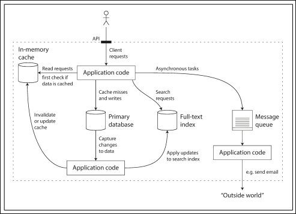

# soren-catalog

> A hands-on implementation of an architecture diagram from **[Designing Data-Intensive Applications](Designing_Data-Intensive_Applications_TH)**, by Martin Kleppmann.

This project started from a simple exercise: take a diagram from the book — an in-memory cache, a primary database, a full-text search index, and an asynchronous message queue all talking to each other — and make every arrow in it actually work, with real containers running and real requests flowing through the system.

## The diagram



Every arrow in the diagram became a testable endpoint in this repo — see [Exercising every arrow](#exercising-every-arrow-in-the-diagram) below.

## Why this exercise

Reading about cache-aside, CDC (change data capture), and async queues is one thing. Watching the process actually crash with `IndexError: pop from empty list` because two different Redis connections (cache and queue) can't share `decode_responses=True` is a completely different kind of learning — and that friction is exactly what this exercise was designed to surface.

## Stack

The chosen domain was a simple product catalog — small enough to not distract from the goal, big enough to exercise all 4 arrows of the diagram.

| Role in the diagram | Piece used | Why |
|---|---|---|
| In-memory cache | **Redis** | The diagram's canonical piece, no substitution |
| Primary database | **PostgreSQL** | Standard relational database |
| Full-text index | **Meilisearch** | Same role as Elasticsearch in the diagram, but spins up in a single container with no JVM/heap tuning — the goal was the concept of "a search index separate from the database", not the specific tool |
| Message queue + worker | **RQ (Redis Queue)** | Reuses the Redis already in the stack as the broker, cutting out an extra service and keeping the focus on the queue → worker → outside-world pattern |
| "Outside world" | **MailHog** | Fake SMTP server with a web UI, so you can actually watch the email arrive |

Internal architecture is layered as `domain` / `application` / `infrastructure`, with abstract interfaces (`Cache`, `SearchIndex`, `TaskQueue`, `ProductRepository`) implemented in the infrastructure layer and wired together via `UseCaseFactory` — the FastAPI routes never know about any concrete class.

```
soren-catalog/
├── docker-compose.yml
├── pyproject.toml
├── worker.py
└── src/
    ├── config.py
    ├── main.py
    ├── domain/
    │   ├── entities.py
    │   └── repositories.py
    ├── application/
    │   └── use_cases.py
    └── infrastructure/
        ├── db/
        ├── cache/
        ├── search/
        ├── queue/
        └── factory.py
```

## Running it

Three terminals:

```bash
docker compose up -d
uv run uvicorn src.main:app --reload
uv run python worker.py
```

Available services:
- API: `http://localhost:8000`
- MailHog (UI): `http://localhost:8025`
- Meilisearch: `http://localhost:7700`

## Exercising every arrow in the diagram

```bash
# 1. write -> writes to the primary db, invalidates the cache, enqueues async indexing
curl -X POST localhost:8000/products -H "Content-Type: application/json" \
  -d '{"name":"Black T-Shirt","description":"100% cotton","price":59.90,"stock":20}'

# 2. read -> cache miss, fetches from Postgres, writes back to the cache (cache-aside)
curl localhost:8000/products/1

# 3. read again -> served straight from Redis
curl localhost:8000/products/1

# 4. search request -> hits Meilisearch directly (give the worker ~1s to index first)
curl "localhost:8000/products/search?q=shirt"

# 5. asynchronous task -> outside world
curl -X POST "localhost:8000/notify/welcome?email=test@test.com&name=Dayvd"
# check it at http://localhost:8025
```

## Two deliberate simplifications (and the real next step)

- **"Capture changes to data" → manual enqueue.** In the book, this flow is typically handled by real CDC (e.g. Debezium reading the Postgres WAL via logical replication). Here, `CreateProductUseCase` simply enqueues the indexing job after the commit. It works for the exercise, but it's a simplification: in a real large-scale architecture, change capture happens at the database level, not in the application layer.
- **The full-text index is updated asynchronously, best-effort.** There's no strong consistency guarantee between Postgres and Meilisearch beyond "the worker got around to it in time" — again, exactly the kind of trade-off real CDC would handle more robustly.

## Bugs hit along the way (and why they're documented here)

Two problems came up while building this, and both taught more than the "ideal" version of the exercise would have:

1. **`TypeError: AbstractConnection.__init__() got an unexpected keyword argument 'decode_response'`** — caused by sharing a single Redis Singleton connection (`decode_responses=True`) between `RedisCache` and `RQTaskQueue`/`Worker`. RQ pickles the job payload and needs raw bytes; the `decode_responses=True` flag conflicts with that (a known RQ issue). Fix: two separate Redis Singleton connections — one for the cache, one for the queue.
2. **Unexpected 404/422 on `/products/search`** — a route-ordering conflict in FastAPI. Since `/products/{product_id}` was declared before `/products/search`, FastAPI tried to match `"search"` as `product_id` and failed the conversion to `int`. Fix: declare literal routes before dynamic-parameter routes that share the same prefix — a rule that applies to any framework that matches routes by declaration order (FastAPI, Express, Flask with manual blueprints).

## Credits

Diagram and architecture concept based on **Designing Data-Intensive Applications**, by Martin Kleppmann (O'Reilly). This repository is a personal study exercise — the implementation is original, with no text from the book reproduced.
